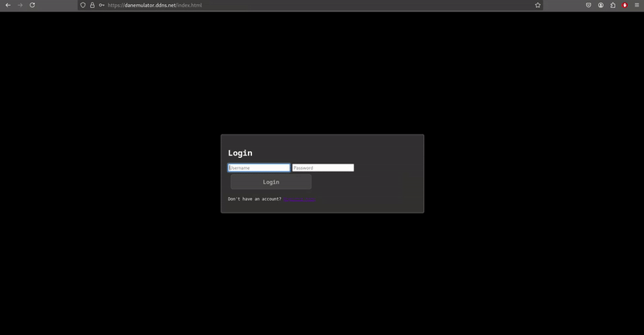
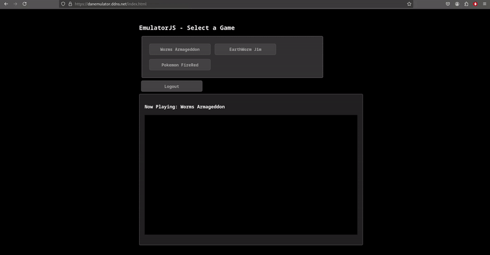
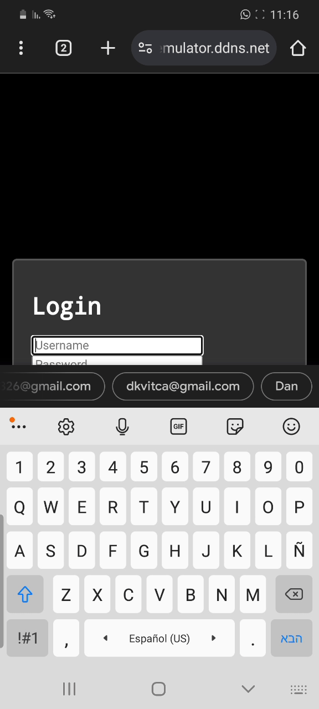

# Root Repository Overview

This repository serves as a unified location for managing and deploying multiple components, organized into three key subdirectories. Each subdirectory focuses on a specific aspect of deployment and application management.

# Online Emulator
This project is a containerized application that provides a browser-based emulator experience. This project was inspired by the [EmulatorJS](https://github.com/EmulatorJS/EmulatorJS) project. the core engine that runs the emulator is from that project, so make sure
to check them out.
The project is designed to be easily deployed on a Kubernetes cluster, in a aws enviorment.

## Browser
<p align="center">
  
  
</p>

# Mobile
<p align="center">
  
  
</p>


## Table of Contents

### 1. Online Emulator
- **Purpose**: Provides a browser-based emulator experience.
- **Key Features**:
  - Frontend served by Nginx.
  - Backend powered by a Flask API.
  - Easily deployable via Docker and Docker Compose.
- **Components**:
  - `FrontEnd/`: Contains the HTML, CSS, and Nginx configurations.
  - `BackEnd/`: Includes the Flask API logic.
  - `docker-compose.yaml`: Manages the multi-container setup.

### 2. Infrastructure as Code (IAC)
- **Purpose**: Manages infrastructure provisioning and deployment using Kubernetes, Helm, and Terraform.
- **Key Features**:
  - Kubernetes manifests for deploying workloads and services.
  - Helm charts for application deployments.
  - Terraform modules for provisioning cloud resources such as EKS clusters, VPCs, and node groups.
- **Components**:
  - `Kubernetes/`: Includes YAML files for workloads, services, and configurations.
  - `Helm/`: Contains Helm charts and templates for dynamic application deployments.
  - `Terraform/`: Provides reusable modules for cloud infrastructure provisioning.

### 3. ArgoCD Configurations
- **Purpose**: Defines and manages application deployments and infrastructure components using ArgoCD.
- **Key Features**:
  - Parent application for orchestrating child applications.
  - Infrastructure components for logging, monitoring, and ingress.
  - Application definitions for emulator and infrastructure.
- **Components**:
  - `parent-app.yaml`: Orchestrates child applications in ArgoCD.
  - `apps/`: Contains individual application configurations.
  - `apps/infra-apps/`: Manages infrastructure-specific configurations like: 
  ``` Fluentd, Prometheus, Elasticsearch, NGINX ingress, cert-manager. ```
##


##


## Purpose of This Repository
This repository acts as a central hub for:
- Application development and deployment.
- Infrastructure management and provisioning.
- Declarative configurations for continuous delivery using ArgoCD.

Each subdirectory can be used independently or in conjunction with the others to achieve a complete deployment pipeline.

