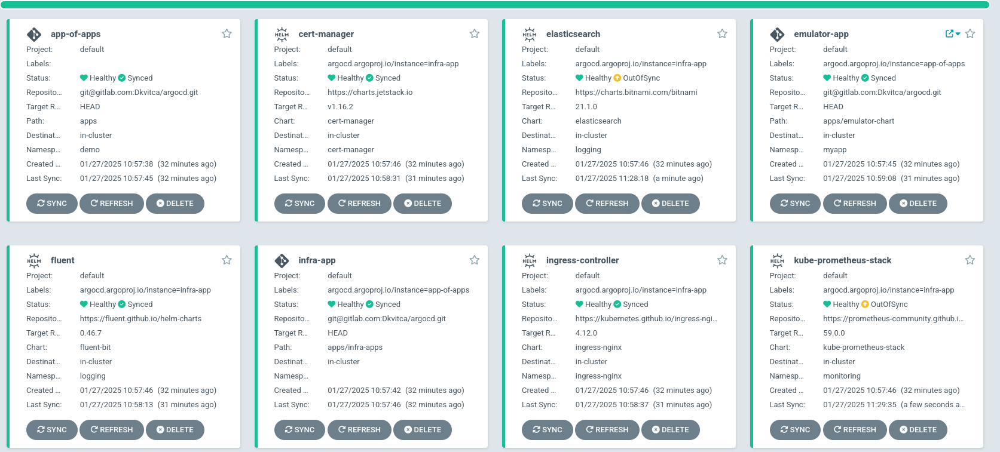

# ArgoCD Configurations

This repository contains configurations for managing applications and infrastructure using ArgoCD. The files are structured to define and deploy resources efficiently in a Kubernetes environment.

## Features
- Application definitions for ArgoCD.
- Infrastructure components for logging, monitoring, and ingress.
- Organized structure for deploying multiple environments or services.

## Components

### Parent Application
- `parent-app.yaml`: The main ArgoCD application manifest to orchestrate child applications.

### Applications
- `apps/`: Contains definitions for individual applications to be managed by ArgoCD.
  - `emulator-app.yaml`: Defines the emulator application deployment.
  - `infra-app.yaml`: Infrastructure-level applications grouping.

### Infrastructure Applications
- `apps/infra-apps/`: Contains infrastructure-specific configurations.
  - `fluentd-app.yaml`: Logging application setup.
  - `prom-app.yaml`: Monitoring using Prometheus.
  - `cert-manager-app.yaml`: Certificate management for TLS.
  - `elastic-app.yaml`: Elasticsearch setup for data indexing and search.
  - `ingress-nginx-app.yaml`: NGINX Ingress controller configuration.
- `values/`: Includes Helm values for customizing deployments.
  - Example files:
    - `fluent-values.yaml`: Custom values for Fluentd.
    - `elasticsearch-values.yaml`: Custom values for Elasticsearch.

##

