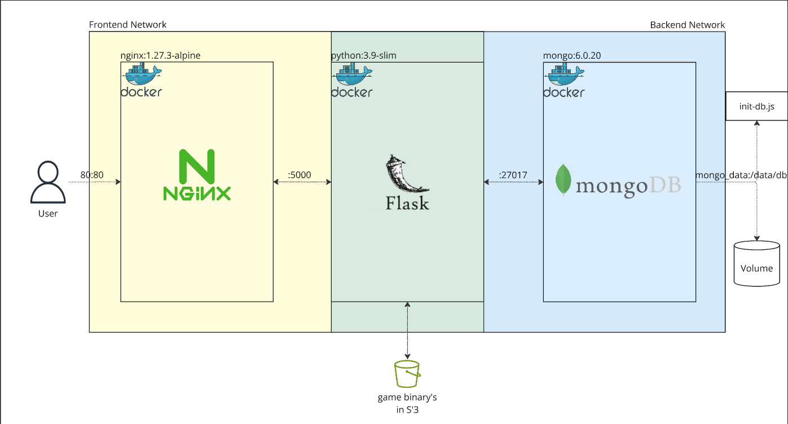
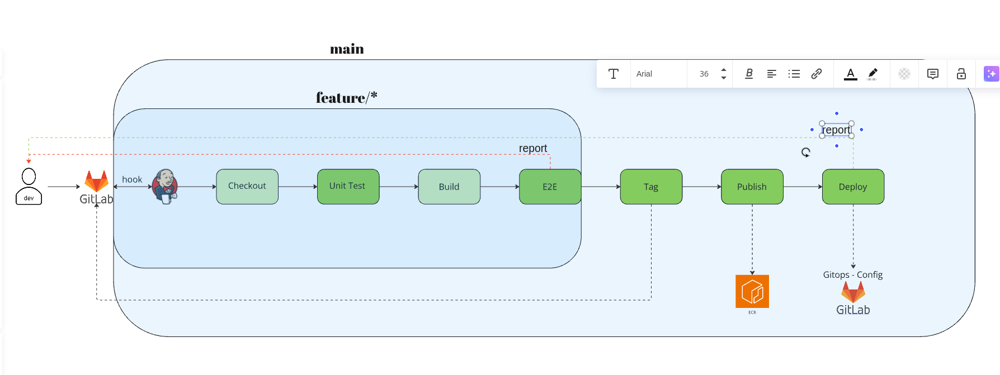

# Online Emulator

The **Online Emulator** is a project designed to provide a browser-based emulator experience. It features a frontend served by Nginx, a backend running a Flask API, and other components, all managed via Docker and Docker Compose.

the core mechanism is based on the ``` https://github.com/EmulatorJS/EmulatorJS ``` project. make sure to check it out.

## Features
- A simple and responsive frontend interface.
- Backend API to handle core logic.
- Easily deployable using Docker.
- Configurable settings for user-specific requirements.

## Prerequisites

Before running this project, ensure you have the following installed on your machine:

1. [Docker](https://www.docker.com/)
2. [Docker Compose](https://docs.docker.com/compose/)

## Configuration

1. Locate the `config.py` file in the project.
2. Fill in the required credentials and settings (marked as blanks or placeholders) to match your environment.

## Installation

Follow these steps to set up and run the project:

1. Clone the repository or extract the provided files to your local machine.
2. Navigate to the project's root directory:
   ```bash
   cd onlineemulator
   ```
3. Ensure `docker-compose.yaml` and all required configuration files are present.

## Running the Project

1. Build and start the containers using Docker Compose:
   ```bash
   docker-compose up --build
   ```
2. Access the application in your web browser at [http://localhost](http://localhost).

3. IMPORTANT: the game binarys are stored in an s3 bucket. you may want to change the init-db to point at the actual files on your machine.
``` 
db = db.getSiblingDB('main_db'); // Switch to the main_db
db.createCollection('games'); // Create the games collection
db.createCollection('users'); // Create the users collection

db.games.insertMany([
  { name: '<string>', url: '<string>', s3_url: '<path to your actual game binary>', core: '<game core: e.g. nes, snes, gba, etc>' }
]);
  
```
4. replace the s3 bucket name with your own. and change the core accoring to the game itself.

## Notes
- Make sure to populate all the necessary fields in `config.py` before running the project.
- If you encounter any issues with the containers, check the logs:
  ```bash
  docker-compose logs
  ```

## Diagram

Below is a visual representation of the architecture used in this project:




## Folder Structure
- `FrontEnd/`: Contains the HTML, CSS, and Nginx configuration for the frontend.
- `BackEnd/`: Contains the Flask API code.
- `docker-compose.yaml`: Manages the multi-container setup.
```
|-- Backend
|   |-- Dockerfile
|   |-- Dockerfile.tests
|   |-- app
|   |   |-- app.py
|   |   |-- config.py
|   |   `-- tests_app.py
|   |-- init-mongo.js
|   `-- requirements.txt
|-- FrontEnd
|   |-- Dockerfile
|   |-- README.md
|   |-- data
|   |   |-- compression
|   |   |   |-- extract7z.js
|   |   |   |-- extractzip.js
|   |   |   |-- libunrar.js
|   |   |   `-- libunrar.wasm
|   |   |-- emulator.css
|   |   |-- loader.js
|   |   |-- localization
|   |   |   |-- Translate.html
|   |   |   |-- af-FR.json
|   |   |   |-- ar-AR.json
|   |   |   |-- ben-BEN.json
|   |   |   |-- de-GER.json
|   |   |   |-- el-GR.json
|   |   |   |-- en.json
|   |   |   |-- es-ES.json
|   |   |   |-- fa-AF.json
|   |   |   |-- hi-HI.json
|   |   |   |-- it-IT.json
|   |   |   |-- ja-JA.json
|   |   |   |-- jv-JV.json
|   |   |   |-- ko-KO.json
|   |   |   |-- pt-BR.json
|   |   |   |-- readme.md
|   |   |   |-- retroarch.json
|   |   |   |-- ru-RU.json
|   |   |   |-- tr-TR.json
|   |   |   |-- vi-VN.json
|   |   |   `-- zh-CN.json
|   |   |-- minify
|   |   |   |-- README.md
|   |   |   |-- index.js
|   |   |   `-- package.json
|   |   |-- src
|   |   |   |-- GameManager.js
|   |   |   |-- compression.js
|   |   |   |-- emulator.js
|   |   |   |-- gamepad.js
|   |   |   |-- nipplejs.js
|   |   |   |-- shaders.js
|   |   |   |-- socket.io.min.js
|   |   |   `-- storage.js
|   |   `-- version.json
|   |-- index.html
|   |-- nginx.conf
|   |-- package.json
|   |-- register.html
|   |-- register.js
|   |-- script.js
|   `-- style.css
|-- Jenkinsfile
|-- README.md
`-- docker-compose.yaml
```
## License
This project is licensed under the MIT License. See the LICENSE file for more details.

